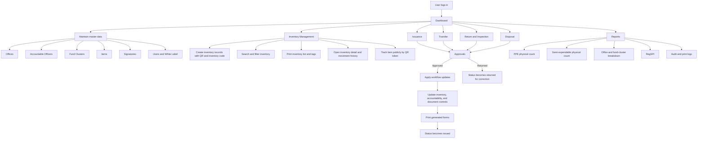
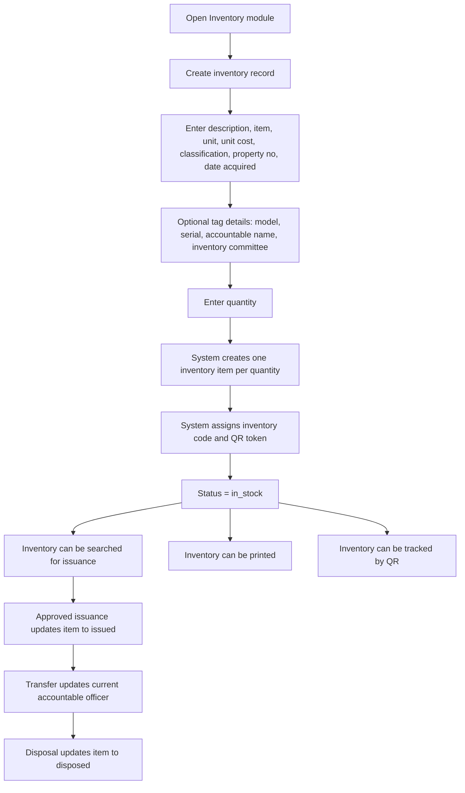
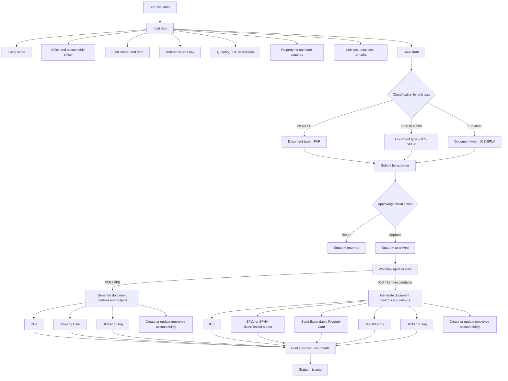
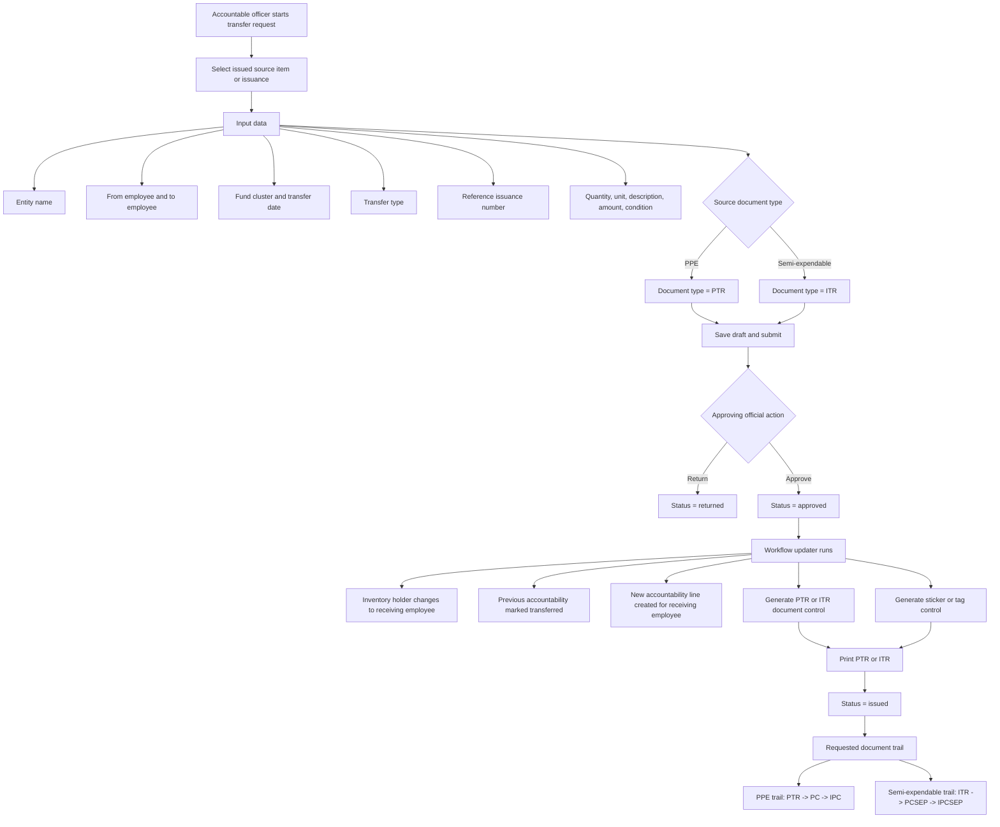
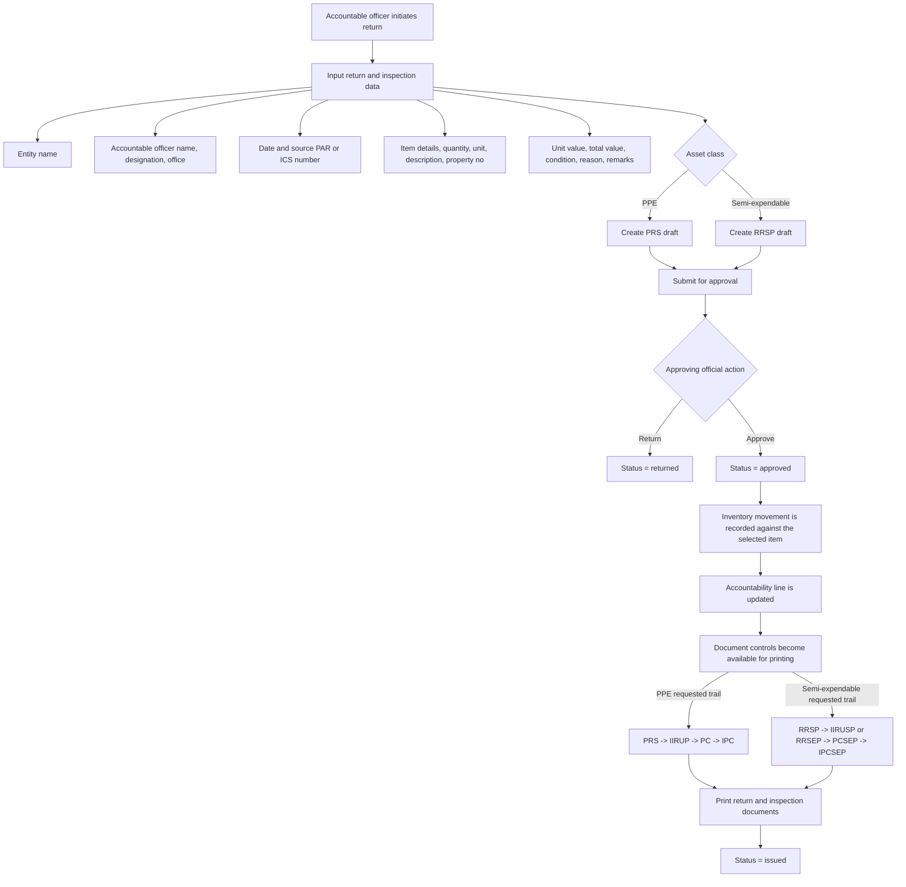
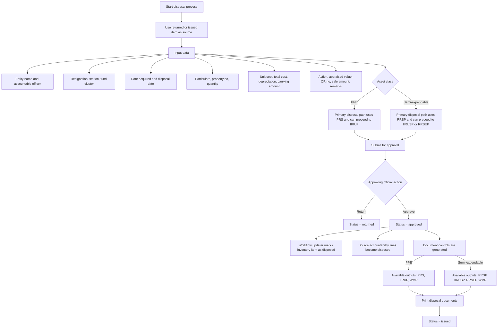
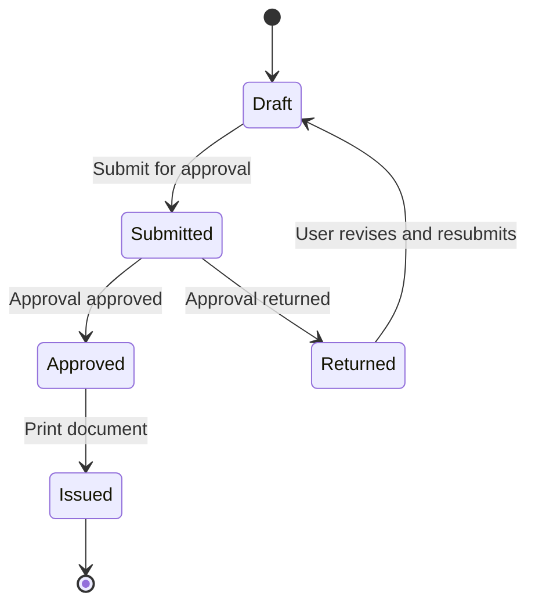

# PGSO Property System Flowchart

This document was updated by checking the implemented Laravel workflow in the current system, then aligning the flow with your reference process for issuance, transfer, return and inspection, disposal, and inventory management.

End-user image version: [system-flowchart-end-user.svg](/public/system-flowchart-end-user.svg)

## Validation Summary

- Issuance classification in code matches the requested threshold flow:
  `PAR` for PPE at `50,000 and above`, `ICS-SPHV` for semi-expendable `5,000 to 49,999`, and `ICS-SPLV` for `1 to 4,999`.
- Inventory management already exists as a real module:
  inventory records can be created manually, searched, printed, viewed individually, and tracked by QR/token.
- Approval is the real trigger for workflow updates:
  cards, accountability, RegSPI entries, and inventory movement updates happen on approval, not on print.
- Printing changes status to `issued` and produces the available PDF outputs.
- Transfer exists as `PTR` for PPE and `ITR` for semi-expendable.
- Return is now a separate module:
  `PRS` is generated for PPE returns and `RRSP` for semi-expendable returns.
- Disposal is now connected to approved return records:
  disposal drafts are created from an approved `PRS` or `RRSP`, then generate disposal outputs such as `IIRUP`, `IIRUSP`, `RRSEP`, and `WMR`.
- The requested return-and-inspection trail is partially implemented in automation:
  return approval updates inventory custody and accountability, but the current code still does not create every downstream card entry shown in the manual flowcharts.

## Overall Process

## Inventory Management Flow

## Property Issuance Flow

## Property Transfer Flow

## Return and Inspection Flow

## Property Disposal Flow

## Status Lifecycle

